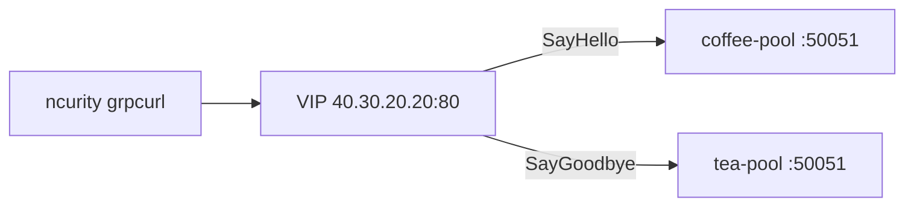

# 3.10 GRPCRoute — method

gRPC **method 이름별로 pool을 나눕니다.**

| RPC | Pool |
|---|---|
| `hello.HelloService/SayHello` | coffee-pool `30.0.0.10:50051` |
| `hello.HelloService/SayGoodbye` | tea-pool `30.0.0.11:50051` |

Gateway listener 는 HTTP :80 (h2c).  
백엔드에 `SayGoodbye` 가 있어야 합니다. `192.168.48.254` 에서:

```bash
# 마스터의 backend/grpc/hello_server.py 를 /opt/poc/grpc/ 에 복사한 뒤
systemctl restart poc-grpc@coffee poc-grpc@tea poc-grpc@canary
```

직접 호출이 `Method not found` 이면 아직 예전 프로세스입니다. VIP 테스트 전에 30.0.0.10/11 에서 SayGoodbye 가 먼저 되어야 합니다.

kubectl 은 마스터. 트래픽은 **ncurity**. PATH snap `grpcurl` 은 쓰지 않습니다.

BNK 2.3 는 `matches` / 한 CR 안 여러 rule 미지원이라고 적혀 있습니다. 그래도 YAML은 명세대로 두 갈래입니다.  
두 RPC가 **같은 pool** 로 가면 매칭 미적용입니다.

https://clouddocs.f5.com/bigip-next-for-kubernetes/latest/custom-resource-definitions/bnk-gateway-api-grpcroute.html

## 구성



## 클라이언트 한 번만 (ncurity)

proto에 `SayGoodbye` 가 있어야 합니다. 예전에 `SayHello` 만 넣었다면 **다시** 만듭니다.

```bash
set -e
mkdir -p "$HOME/poc-grpc"
cat > "$HOME/poc-grpc/hello.proto" << 'EOF'
syntax = "proto3";

package hello;

service HelloService {
  rpc SayHello (HelloRequest) returns (HelloReply);
  rpc SayGoodbye (HelloRequest) returns (HelloReply);
}

message HelloRequest {
  string name = 1;
}

message HelloReply {
  string message = 1;
}
EOF

if [ ! -x "$HOME/poc-grpc/grpcurl" ]; then
  arch=$(uname -m)
  case "$arch" in
    x86_64)  rel=linux_x86_64 ;;
    aarch64) rel=linux_arm64 ;;
    *) echo "unsupported arch: $arch"; exit 1 ;;
  esac
  curl -fsSL "https://github.com/fullstorydev/grpcurl/releases/download/v1.9.3/grpcurl_1.9.3_${rel}.tar.gz" \
    | tar -xz -C "$HOME/poc-grpc" grpcurl
  chmod +x "$HOME/poc-grpc/grpcurl"
fi
ls -l "$HOME/poc-grpc/hello.proto" "$HOME/poc-grpc/grpcurl"
```

## 적용 (마스터)

```bash
kubectl apply -f gw-grpc-route.yaml
```

## 클라이언트 검증 (ncurity)

직접 백엔드 (서버에 두 method가 있는지):

```bash
"$HOME/poc-grpc/grpcurl" -plaintext \
  -import-path "$HOME/poc-grpc" -proto hello.proto \
  -d '{"name":"BNK"}' 30.0.0.10:50051 hello.HelloService/SayHello

"$HOME/poc-grpc/grpcurl" -plaintext \
  -import-path "$HOME/poc-grpc" -proto hello.proto \
  -d '{"name":"BNK"}' 30.0.0.11:50051 hello.HelloService/SayGoodbye
```

**기대** `COFFEE GRPC - 30.0.0.10 hello BNK` / `TEA GRPC - 30.0.0.11 goodbye BNK`

### 1. VIP SayHello → coffee

```bash
"$HOME/poc-grpc/grpcurl" -plaintext -authority grpc.f5bnk.com \
  -import-path "$HOME/poc-grpc" -proto hello.proto \
  -d '{"name":"BNK"}' \
  40.30.20.20:80 hello.HelloService/SayHello
```

**기대** `COFFEE GRPC - 30.0.0.10 hello BNK`

### 2. VIP SayGoodbye → tea

```bash
"$HOME/poc-grpc/grpcurl" -plaintext -authority grpc.f5bnk.com \
  -import-path "$HOME/poc-grpc" -proto hello.proto \
  -d '{"name":"BNK"}' \
  40.30.20.20:80 hello.HelloService/SayGoodbye
```

**기대 (method 매칭 적용 시)** `TEA GRPC - 30.0.0.11 goodbye BNK`

**미적용 시** 둘 다 coffee (`... hello BNK` 와 `... goodbye BNK` 가 같은 `30.0.0.10`)

### 3. HTTP로는 매칭 안 됨

```bash
curl --resolve grpc.f5bnk.com:80:40.30.20.20 http://grpc.f5bnk.com/
```

**기대** 실패 또는 미매칭. gRPC HTTP/2 가 아님.

## 정리 (마스터)

```bash
kubectl delete -f gw-grpc-route.yaml
```
