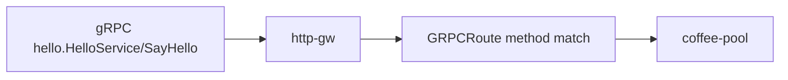

# 3.10 GRPCRoute — method

## 구성



## 사전 준비

백엔드가 gRPC `hello.HelloService/SayHello` 를 제공해야 합니다. 클라이언트에 `grpcurl` 권장.

## 적용

```bash
kubectl apply -f gw-grpc-route.yaml
```

명령은 VIP `40.30.20.20` 에 터널로 도달하는 클라이언트에서 실행합니다.

## 클라이언트 검증

### 1. 매칭 method

```bash
# grpcurl 이 있을 때
grpcurl -plaintext -authority grpc.f5bnk.com 40.30.20.20:80 hello.HelloService/SayHello
```

**기대 응답**
- SayHello 가 coffee-pool로 전달
- 다른 service/method 는 매칭 없음 (UNIMPLEMENTED/404)

### 2. HTTP로는 매칭 안 됨

```bash
curl --resolve grpc.f5bnk.com:80:40.30.20.20 http://grpc.f5bnk.com/
```

**기대 응답**
- GRPCRoute는 gRPC(HTTP/2) 요청을 대상으로 함. 일반 curl HTTP/1.1 은 실패하거나 미매칭

## 정리

```bash
kubectl delete -f gw-grpc-route.yaml
```
