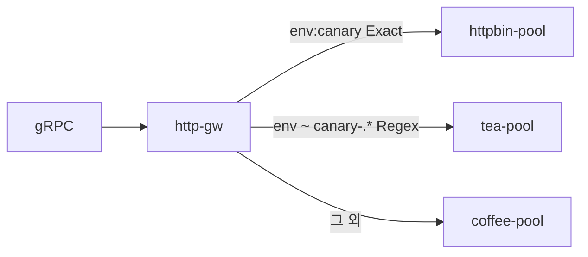

# 3.11 GRPCRoute — headers Exact / RegularExpression

## 구성



## 적용

```bash
kubectl apply -f gw-grpc-route.yaml
```

명령은 VIP `40.30.20.20` 에 터널로 도달하는 클라이언트에서 실행합니다.

## 클라이언트 검증

### 1. Exact

```bash
grpcurl -plaintext -authority grpc.f5bnk.com \
  -H 'env: canary' 40.30.20.20:80 hello.HelloService/SayHello
```

**기대 응답**
- httpbin-pool로 분기

### 2. RegularExpression

```bash
grpcurl -plaintext -authority grpc.f5bnk.com \
  -H 'env: canary-01' 40.30.20.20:80 hello.HelloService/SayHello
```

**기대 응답**
- tea-pool로 분기
- 구현체가 header regex 미지원이면 해당 rule Accepted=False / UnsupportedValue

### 3. 헤더 없음

```bash
grpcurl -plaintext -authority grpc.f5bnk.com \
  40.30.20.20:80 hello.HelloService/SayHello
```

**기대 응답**
- coffee-pool

## 정리

```bash
kubectl delete -f gw-grpc-route.yaml
```
