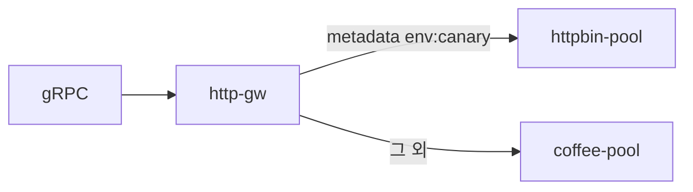

# 3.11 GRPCRoute — header

## 구성



## 적용

```bash
kubectl apply -f gw-grpc-route.yaml
```

명령은 VIP `40.30.20.20` 에 터널로 도달하는 클라이언트에서 실행합니다.

## 클라이언트 검증

### 1. 헤더 매칭

```bash
grpcurl -plaintext -authority grpc.f5bnk.com \
  -H 'env: canary' 40.30.20.20:80 hello.HelloService/SayHello
```

**기대 응답**
- canary → httpbin-pool
- 헤더 없으면 coffee-pool

## 정리

```bash
kubectl delete -f gw-grpc-route.yaml
```
