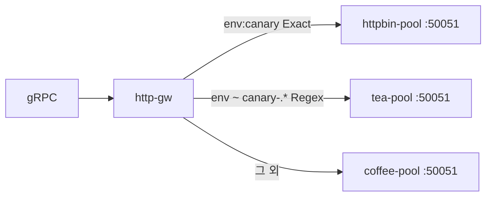

# 3.11 GRPCRoute — headers Exact / RegularExpression

gRPC metadata header 로 backend 를 나눕니다.

## 구성



## 적용

```bash
kubectl apply -f gw-grpc-route.yaml
```

명령은 클라이언트 **ncurity** 에서 실행합니다.  
`"$HOME/poc-grpc"` 는 3.10 README 블록을 한 번 실행해 둡니다.

## 클라이언트 검증

### 1. Exact

```bash
"$HOME/poc-grpc/grpcurl" -plaintext -authority grpc.f5bnk.com \
  -import-path "$HOME/poc-grpc" -proto hello.proto -d '{"name":"BNK"}' \
  -H 'env: canary' 40.30.20.20:80 hello.HelloService/SayHello
```

**기대 응답**
- httpbin-pool (`CANARY GRPC - 30.0.0.12`)

### 2. RegularExpression

```bash
"$HOME/poc-grpc/grpcurl" -plaintext -authority grpc.f5bnk.com \
  -import-path "$HOME/poc-grpc" -proto hello.proto -d '{"name":"BNK"}' \
  -H 'env: canary-01' 40.30.20.20:80 hello.HelloService/SayHello
```

**기대 응답**
- tea-pool (`TEA GRPC - 30.0.0.11`)
- 구현체가 header regex 미지원이면 해당 rule Accepted=False / UnsupportedValue

### 3. 헤더 없음

```bash
"$HOME/poc-grpc/grpcurl" -plaintext -authority grpc.f5bnk.com \
  -import-path "$HOME/poc-grpc" -proto hello.proto -d '{"name":"BNK"}' \
  40.30.20.20:80 hello.HelloService/SayHello
```

**기대 응답**
- coffee-pool (`COFFEE GRPC - 30.0.0.10`)

명령이 잘못된 게 아닙니다. `-H 'env: canary'` 는 gRPC metadata로 전달됩니다. 이전 live에서 백엔드 로그에 `env` 가 찍혔습니다.

BNK 2.3 GRPCRoute 는 **kind 자체는 지원**하지만 아래는 공식 미지원입니다.

- `matches` (header / method)
- `filters`
- `hostnames`
- 한 GRPCRoute 안 **여러 rule**

https://clouddocs.f5.com/bigip-next-for-kubernetes/latest/custom-resource-definitions/bnk-gateway-api-grpcroute.html

그래서 헤더와 관계없이 **첫 rule 백엔드**(httpbin-pool `30.0.0.12` CANARY)로만 갑니다. Accepted=True 여도 header 분기는 안 됩니다.

F5 전용 대체 CRD 는 없습니다. `L4Route` 는 TCP/UDP 패스스루라 gRPC metadata를 못 봅니다. TCPRoute 때의 L4Route와 다릅니다.

## 정리

```bash
kubectl delete -f gw-grpc-route.yaml
```

## live 결과

Accepted=True. grpcurl `-H env:` 메타데이터는 백엔드 로그에 도달했으나 모든 RPC가 첫 rule(canary). gRPC header iRule 없음.
