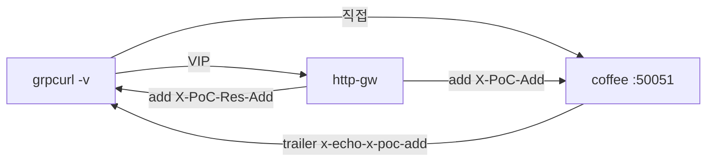

# 3.12 GRPCRoute — request/response modifier

gRPC 요청·응답 metadata 를 추가합니다.

coffee `hello_server` 는 요청 metadata `x-poc-add` 가 있으면 trailer `x-echo-x-poc-add` 로 echo 한다.  
응답 `X-PoC-Res-Add` 는 백엔드가 안 만들고, Gateway 가 붙이는 값이다.

그래서 **원본 직접** 과 **VIP** 의 `grpcurl -v` trailer·응답 헤더를 같이 본다.



## 적용

```bash
kubectl apply -f gw-grpc-route-f1.yaml
```

명령은 클라이언트 **ncurity** 에서 실행합니다.  
`"$HOME/poc-grpc"` 는 3.10 README 블록을 한 번 실행해 둡니다.

## 클라이언트 검증

같은 RPC, `grpcurl -v`. 볼 곳:

| 어디서 | 의미 |
|---|---|
| Response trailers `x-echo-x-poc-add: added` | 백엔드가 요청 `X-PoC-Add` 를 받았음 (req add) |
| Response headers `x-poc-res-add: added` | Gateway 가 응답에 헤더를 붙였음 (res add) |

### 1. 원본 직접 — 헤더 없음 (기준)

Gateway 없이 coffee 만.

```bash
"$HOME/poc-grpc/grpcurl" -plaintext -v \
  -import-path "$HOME/poc-grpc" -proto hello.proto -d '{"name":"BNK"}' \
  30.0.0.10:50051 hello.HelloService/SayHello
```

**기대**
- Body: `COFFEE GRPC - 30.0.0.10 hello BNK`
- Response trailers 에 `x-echo-x-poc-add` 없음 (요청에 `X-PoC-Add` 없음)
- Response headers 에 `x-poc-res-add` 없음 (백엔드가 안 만듦)

### 2. 원본 직접 — 요청 헤더를 클라이언트가 넣음

echo 가 살아 있는지.

```bash
"$HOME/poc-grpc/grpcurl" -plaintext -v \
  -import-path "$HOME/poc-grpc" -proto hello.proto -d '{"name":"BNK"}' \
  -H 'x-poc-add: added' \
  30.0.0.10:50051 hello.HelloService/SayHello
```

**기대**
- Response trailers: `x-echo-x-poc-add: added`
- Response headers 에 `x-poc-res-add` 는 여전히 없음

### 3. VIP — 클라이언트는 헤더를 안 넣음

Gateway 가 req/res 를 붙이는지. 1번과 같은 curl 이고 주소만 VIP.

```bash
"$HOME/poc-grpc/grpcurl" -plaintext -authority grpc.f5bnk.com -v \
  -import-path "$HOME/poc-grpc" -proto hello.proto -d '{"name":"BNK"}' \
  40.30.20.20:80 hello.HelloService/SayHello
```

**기대 (modifier 적용 시)**
- Body 는 1번과 같음
- Response trailers: `x-echo-x-poc-add: added` (1번과 다름 → Gateway 가 요청에 `X-PoC-Add` 를 넣음)
- Response headers: `x-poc-res-add: added` (2번도 없음 → Gateway 가 응답에 붙임)

**미적용 시** 1번과 같음. trailer 비어 있고 `x-poc-res-add` 없음.

## 정리

```bash
kubectl delete -f gw-grpc-route-f1.yaml
```

## live 결과

Accepted=True. VIP → coffee 200 (`COFFEE GRPC - 30.0.0.10 hello BNK`).
`grpcurl -v`: 응답 헤더에 `X-PoC-Res-Add` 없음, trailer 비어 있음 (`x-echo-x-poc-add` 없음 → 요청 add도 미적용).
BNK GRPCRoute `filters` 미지원. 원본 직접(1번)과 VIP(3번) trailer 가 같음.

## iRule 우회

네이티브 HeaderModifier 미적용. `gw-grpc-route_iRule.yaml` 은 `HTTP_REQUEST` 에 `X-PoC-Add: added`, `HTTP_RESPONSE` 에 `X-PoC-Res-Add: added`.  
네이티브 YAML 과 같이 apply 하지 않는다.

```bash
kubectl apply -f gw-grpc-route_iRule.yaml
```

검증은 위 1·2·3 과 같다. iRule 적용 시 3번이 1번과 달라야 한다 (trailer echo + 응답 `x-poc-res-add`).

```bash
kubectl delete -f gw-grpc-route_iRule.yaml
```
