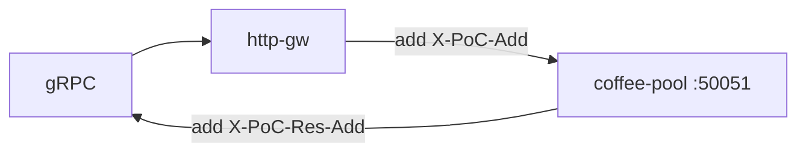

# 3.12 GRPCRoute — request/response modifier

gRPC 요청·응답 metadata header 를 추가합니다.

## 구성



## 적용

```bash
kubectl apply -f gw-grpc-route.yaml
```

명령은 VIP `40.30.20.20` 에 터널로 도달하는 클라이언트에서 실행합니다.

## 클라이언트 검증

### 1. 헤더 수정 후 호출

```bash
grpcurl -plaintext -authority grpc.f5bnk.com -v 40.30.20.20:80 hello.HelloService/SayHello
```

**기대 응답**
- 백엔드가 `X-PoC-Add: added` 수신 (서버 reply 또는 로그)
- 클라이언트 응답 헤더/트레일러에 `X-PoC-Res-Add: added`

## 정리

```bash
kubectl delete -f gw-grpc-route.yaml
```
