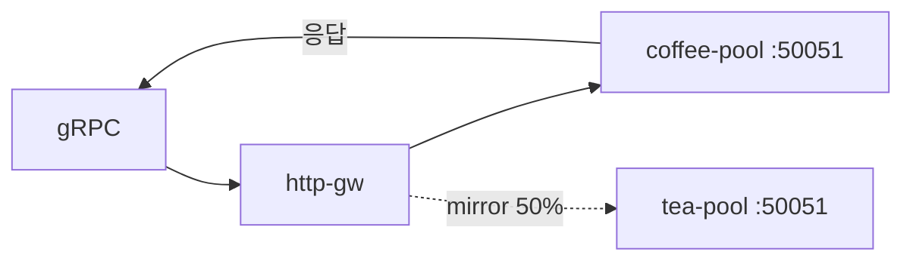

# 3.13 GRPCRoute — RequestMirror

주 backend 응답만 client에 반환하고, 요청 복사본을 percent 비율로 mirror 합니다.  
CRD 에 `percent` / `fraction` 필드가 있습니다. 실제 미러 동작은 live 확인.

## 구성



## 적용

```bash
kubectl apply -f gw-grpc-route.yaml
```

명령은 클라이언트 **ncurity** 에서 실행합니다.  
`"$HOME/poc-grpc"` 는 3.10 README 블록을 한 번 실행해 둡니다.

## 클라이언트 검증

### 1. primary 응답 유지

```bash
"$HOME/poc-grpc/grpcurl" -plaintext -authority grpc.f5bnk.com \
  -import-path "$HOME/poc-grpc" -proto hello.proto -d '{"name":"BNK"}' \
  40.30.20.20:80 hello.HelloService/SayHello
```

**기대 응답**
- 클라이언트는 coffee-pool 응답만 봄 (`COFFEE GRPC - 30.0.0.10`)
- tea 응답이 섞이면 BNK가 mirror 응답을 버린 게 아님
- 백엔드 gRPC 로그에 tea 쪽 요청이 늘어야 mirror 전달

### 2. percent 비율

```bash
for i in $(seq 1 40); do
  "$HOME/poc-grpc/grpcurl" -plaintext -authority grpc.f5bnk.com \
    -import-path "$HOME/poc-grpc" -proto hello.proto -d '{"name":"BNK"}' \
    40.30.20.20:80 hello.HelloService/SayHello >/dev/null
done
```

**기대 응답**
- 40회 모두 클라이언트는 coffee 응답
- tea-pool 수신은 약 50% (percent: 50)

## 정리

```bash
kubectl delete -f gw-grpc-route.yaml
```

## live 결과

Accepted=True. 10 RPC client는 모두 coffee. tea:50051 미러 0. gRPC mirror iRule 없음.

iRule로는 불가. HTTP 2.27 HSL 복사는 HTTP/1 바이트이다. gRPC는 HTTP/2 DATA 프레임이라 tea:50051 gRPC 서버가 HSL TCP 복사를 요청으로 파싱하지 못한다. SIDEBAND h2 미러도 이 TMM에서 없다.
