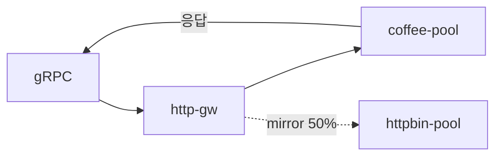

# 3.13 GRPCRoute — RequestMirror

주 backend 응답만 client에 반환하고, 요청 복사본을 percent 비율로 mirror 합니다.

## 구성



## 적용

```bash
kubectl apply -f gw-grpc-route.yaml
```

명령은 VIP `40.30.20.20` 에 터널로 도달하는 클라이언트에서 실행합니다.

## 클라이언트 검증

### 1. primary 응답 유지

```bash
grpcurl -plaintext -authority grpc.f5bnk.com \
  40.30.20.20:80 hello.HelloService/SayHello
```

**기대 응답**
- 클라이언트는 coffee-pool 응답만 봄
- mirror 응답은 무시

### 2. percent 비율

```bash
for i in $(seq 1 40); do
  grpcurl -plaintext -authority grpc.f5bnk.com \
    40.30.20.20:80 hello.HelloService/SayHello >/dev/null
done
```

**기대 응답**
- 40회 모두 클라이언트는 coffee 응답
- httpbin-pool 수신은 약 50% (percent: 50)

## 정리

```bash
kubectl delete -f gw-grpc-route.yaml
```
