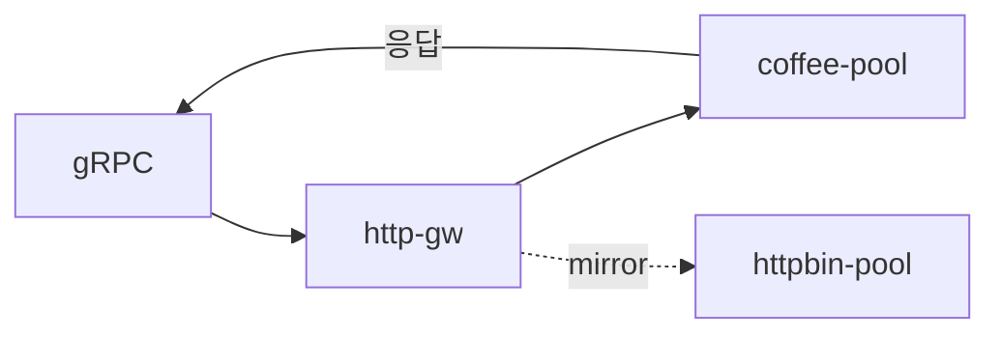

# 3.13 GRPCRoute — RequestMirror

## 구성



## 적용

```bash
kubectl apply -f gw-grpc-route.yaml
```

명령은 VIP `40.30.20.20` 에 터널로 도달하는 클라이언트에서 실행합니다.

## 클라이언트 검증

### 1. primary 응답

```bash
grpcurl -plaintext -authority grpc.f5bnk.com 40.30.20.20:80 hello.HelloService/SayHello
```

**기대 응답**
- 클라이언트는 coffee-pool 응답만 봄
- httpbin-pool 로그에도 미러 호출이 있어야 함

## 정리

```bash
kubectl delete -f gw-grpc-route.yaml
```
