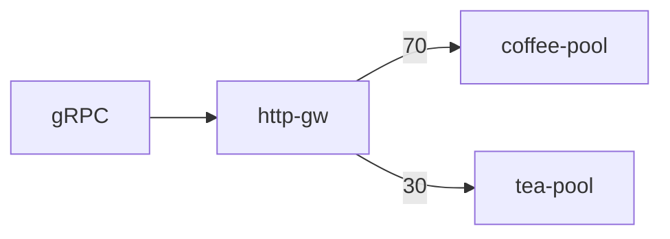

# 3.14 GRPCRoute — weight

## 구성



## 적용

```bash
kubectl apply -f gw-grpc-route.yaml
```

명령은 VIP `40.30.20.20` 에 터널로 도달하는 클라이언트에서 실행합니다.

## 클라이언트 검증

### 1. 가중 분배

```bash
for i in $(seq 1 20); do
  grpcurl -plaintext -authority grpc.f5bnk.com 40.30.20.20:80 hello.HelloService/SayHello
done
```

**기대 응답**
- coffee 쪽이 더 많은 응답. 약 70/30

## 정리

```bash
kubectl delete -f gw-grpc-route.yaml
```
