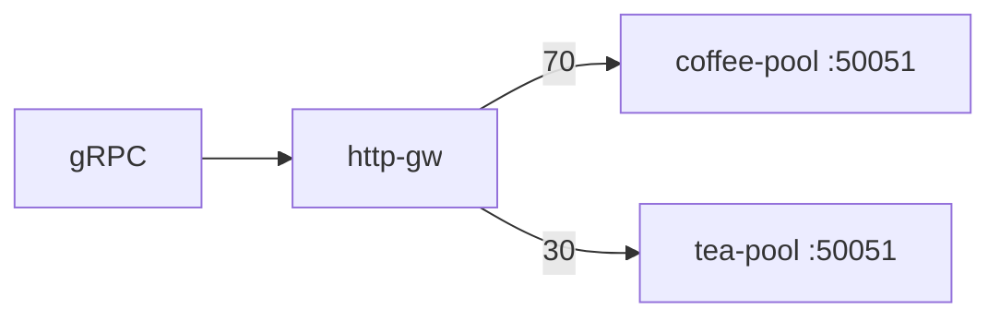

# 3.14 GRPCRoute — weight

복수 gRPC backendRef 의 상대 weight 로 RPC 를 나눕니다.

## 구성



## 적용

```bash
kubectl apply -f gw-grpc-route.yaml
```

명령은 클라이언트 **ncurity** 에서 실행합니다.  
`"$HOME/poc-grpc"` 는 3.10 README 블록을 한 번 실행해 둡니다.

## 클라이언트 검증

### 1. 가중 분배

```bash
for i in $(seq 1 40); do
    "$HOME/poc-grpc/grpcurl" -plaintext -authority grpc.f5bnk.com \
    -import-path "$HOME/poc-grpc" -proto hello.proto -d '{"name":"BNK"}' \
    40.30.20.20:80 hello.HelloService/SayHello
done | sort | uniq -c
```

**기대 응답**
- coffee / tea 가 대략 70/30. 40회면 반드시 28/12는 아님.
- `-proto` 없이 호출하면 Reflection RST_STREAM.

## 정리

```bash
kubectl delete -f gw-grpc-route.yaml
```

## 참고

BNK 2.3 GRPCRoute: **`backendRefs.weight` 는 지원**. hostnames / matches / filters / sessionPersistence / 한 CR 안 여러 rule 은 미지원.  
https://clouddocs.f5.com/bigip-next-for-kubernetes/latest/custom-resource-definitions/bnk-gateway-api-grpcroute.html
