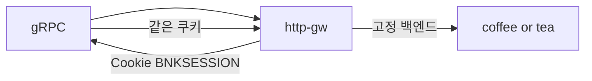

# 3.15 GRPCRoute — Session Persistence Cookie

## 구성



## 적용

```bash
kubectl apply -f gw-grpc-route.yaml
```

명령은 VIP `40.30.20.20` 에 터널로 도달하는 클라이언트에서 실행합니다.

## 클라이언트 검증

### 1. 쿠키 고정

```bash
# 첫 호출에서 Set-Cookie 확인 후 동일 쿠키로 반복
grpcurl -plaintext -authority grpc.f5bnk.com -v 40.30.20.20:80 hello.HelloService/SayHello
```

**기대 응답**
- 응답에 BNKSESSION 쿠키
- 이후 동일 쿠키는 같은 백엔드

## 정리

```bash
kubectl delete -f gw-grpc-route.yaml
```
