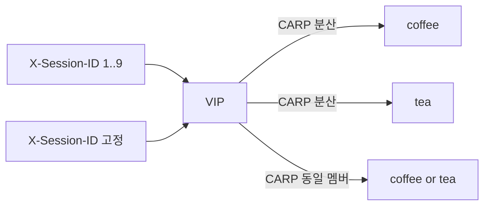

# 3.15 GRPCRoute — Session Persistence Header

네이티브 `sessionPersistence` 는 CRD 스키마 거부.  
iRule `persist carp`. persist 테이블/DSSM 없이 `X-Session-ID` 값을 해시해서 같은 멤버.  
coffee+tea 를 한 Pool 에 둠. 멤버 IP 를 iRule 에서 고르지 않는다.



## 적용

```bash
kubectl apply -f gw-grpc-route_iRule.yaml
```

명령은 클라이언트 **ncurity** 에서 실행합니다.  
`"$HOME/poc-grpc"` 는 3.10 README 블록을 한 번 실행해 둡니다.  
grpcurl 한 호출이 연결 하나라 `--no-keepalive` 와 같다. TMM 카운터는 클러스터.

## 클라이언트 검증

### 1. 헤더 값 1–9 — 멤버 분산

마지막 `X-Session-ID` 값만 바꾼다. CARP 해시가 두 멤버로 갈린다.

```bash
for i in $(seq 1 9); do
  "$HOME/poc-grpc/grpcurl" -plaintext -authority grpc.f5bnk.com \
    -import-path "$HOME/poc-grpc" -proto hello.proto -d '{"name":"BNK"}' \
    -H "X-Session-ID: $i" \
    40.30.20.20:80 hello.HelloService/SayHello
done | sort | uniq -c
```

**기대 응답**
- `COFFEE GRPC - 30.0.0.10 hello BNK` / `TEA GRPC - 30.0.0.11 hello BNK` 둘 다
- 대략 고르게 (한쪽만 9회면 실패)

### 2. 한 값 20회 — 고정

```bash
for i in $(seq 1 20); do
  "$HOME/poc-grpc/grpcurl" -plaintext -authority grpc.f5bnk.com \
    -import-path "$HOME/poc-grpc" -proto hello.proto -d '{"name":"BNK"}' \
    -H 'X-Session-ID: 1' \
    40.30.20.20:80 hello.HelloService/SayHello
done | sort | uniq -c
```

**기대 응답**
- 20회 모두 같은 body (1번에서 `1` 이 간 멤버)

### 3. 두 TMM 모두 수신

앞단 L4 ECMP 가 TMM `172.24.0.10` / `172.24.0.11` 로 나눈다. grpcurl 호출마다 소스 포트가 달라져 양쪽 TMM 에 들어간다. persist DB 가 없어서 어느 TMM 이든 같은 `X-Session-ID` → 같은 멤버.

클러스터에서 카운터를 찍고, 클라이언트로 2번을 다시 친 뒤 다시 찍는다.

```bash
for pod in $(kubectl get pod -n f5-bnk-instance -l app=f5-tmm \
  -o jsonpath='{.items[*].metadata.name}'); do
  echo "=== $pod ==="
  kubectl exec -n f5-bnk-instance "$pod" -c debug -- \
    tmctl -d blade virtual_server_stat -s name,clientside.tot_conns
done
```

**기대**
- 두 TMM 파드 모두 `tot_conns` 증가
- client body 는 계속 2번과 같음

## 정리

```bash
kubectl delete -f gw-grpc-route_iRule.yaml
```

## 네이티브

`gw-grpc-route.yaml` 은 native Header persist. `sessionPersistence` 필드는 스키마에 없어 apply 가 apiserver 에서 거부된다 (experimental GEP-1619, standard channel 미포함). iRule 과 같이 apply 하지 않는다.
