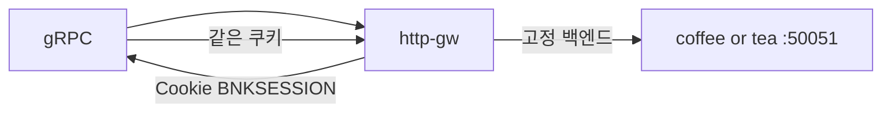

# 3.15 GRPCRoute — Session Persistence Cookie

Cookie 로 동일 gRPC backend 에 세션을 고정합니다.

클러스터 GRPCRoute v1 CRD 의 `rules` 키는 `backendRefs` / `filters` / `matches` / `name` 뿐입니다.  
`sessionPersistence` 필드는 스키마에 없어 apply 가 apiserver 에서 거부됩니다 (experimental GEP-1619, standard channel 미포함).

## 구성



## 적용

```bash
kubectl apply -f gw-grpc-route.yaml
```

명령은 클라이언트 **ncurity** 에서 실행합니다.  
`"$HOME/poc-grpc"` 는 3.10 README 블록을 한 번 실행해 둡니다.

## 클라이언트 검증

### 1. 스키마 거부 (현재 CRD)

```bash
kubectl apply -f gw-grpc-route.yaml
```

**기대 응답**
- apiserver: `sessionPersistence` unknown field / validation error
- apply 가 실패하면 이 항목은 미지원으로 기록

### 2. 필드가 받아지면 쿠키 고정

```bash
"$HOME/poc-grpc/grpcurl" -plaintext -authority grpc.f5bnk.com -v \
  -import-path "$HOME/poc-grpc" -proto hello.proto -d '{"name":"BNK"}' \
  40.30.20.20:80 hello.HelloService/SayHello
```

**기대 응답**
- 응답에 BNKSESSION 쿠키
- 이후 동일 쿠키는 같은 백엔드

## 정리

```bash
kubectl delete -f gw-grpc-route.yaml
```

## iRule 우회

네이티브 `sessionPersistence` 는 CRD 스키마 거부. `gw-grpc-route_iRule.yaml` 은 2.43 과 같이 Cookie → `pool`. grpcurl 은 `-H 'cookie: BNKSESSION=coffee'`. Set-Cookie 가 h2 응답에 붙는지는 live.  
네이티브 YAML 과 같이 apply 하지 않는다.

```bash
kubectl apply -f gw-grpc-route_iRule.yaml
```

```bash
kubectl delete -f gw-grpc-route_iRule.yaml
```
