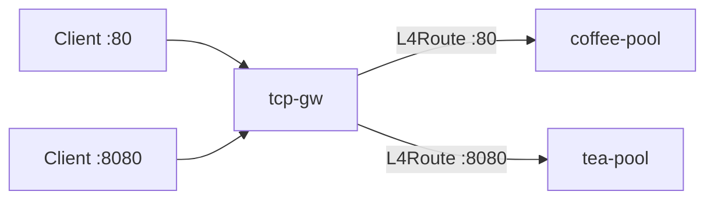

# 3.16 TCPRoute — Listener

Gateway API `TCPRoute` kind 미지원. BNK native: **protocol TCP + L4Route**.

## 구성



## 적용

```bash
kubectl apply -f gw-tcp-route.yaml
```

## 클라이언트 검증

```bash
curl -sS http://40.30.20.20/
curl -sS http://40.30.20.20:8080/
```

**live 결과**
- :80 → `COFFEE SERVER - 30.0.0.10`
- :8080 → `TEA SERVER - 30.0.0.11`
- Gateway supportedKinds=`L4Route`

## 정리

```bash
kubectl delete -f gw-tcp-route.yaml
```
