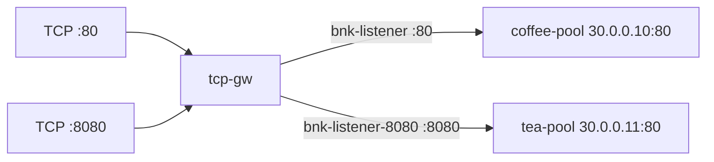

# 3.16 TCPRoute — listener / parentRef

두 TCP listener/Route로 port별 backend를 나눕니다.  
backend 는 기존 HTTP :80 으로도 L4 전달을 확인할 수 있습니다.

## 구성



## 적용

```bash
kubectl apply -f gw-tcp-route.yaml
```

명령은 VIP `40.30.20.20` 에 터널로 도달하는 클라이언트에서 실행합니다.

## 클라이언트 검증

### 1. port 80 → coffee

```bash
echo -e 'GET / HTTP/1.1\r\nHost: x\r\nConnection: close\r\n\r\n' | nc -w 3 40.30.20.20 80
```

**기대 응답**
- TCP 연결 성공
- Body `COFFEE SERVER - 30.0.0.10`
- Host/path 매칭 없음 (L4)

### 2. port 8080 → tea

```bash
echo -e 'GET / HTTP/1.1\r\nHost: x\r\nConnection: close\r\n\r\n' | nc -w 3 40.30.20.20 8080
```

**기대 응답**
- TCP 연결 성공
- Body `TEA SERVER - 30.0.0.11`
- 양방향 payload가 해당 backend로만 감

## 정리

```bash
kubectl delete -f gw-tcp-route.yaml
```

## 참고

TCPRoute는 L4입니다. hostname/path 매칭이 없습니다.  
BNK 2.3 지원 kind 는 L4Route (`gateway.k8s.f5net.com`) 이지 TCPRoute 가 아닙니다. TCPRoute apply 후 Listener `InvalidRouteKinds` 이면 문서와 일치.
