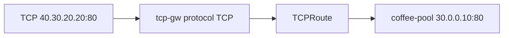

# 3.16 TCPRoute — listener / parentRef

## 구성



## 적용

```bash
kubectl apply -f gw-tcp-route.yaml
```

명령은 VIP `40.30.20.20` 에 터널로 도달하는 클라이언트에서 실행합니다.

## 클라이언트 검증

### 1. L4 전달 (HTTP 페이로드로 확인)

```bash
echo -e 'GET / HTTP/1.1\r\nHost: coffee.f5bnk.com\r\nConnection: close\r\n\r\n' | nc -w 3 40.30.20.20 80
```

**기대 응답**
- TCP 연결 성공
- Host 매칭 없이 L4로 coffee에 가서 body `COFFEE SERVER - 30.0.0.10` (또는 coffee 서버의 / 응답)
- HTTPRoute처럼 Host로 가르지 않음

## 정리

```bash
kubectl delete -f gw-tcp-route.yaml
```

## 참고

TCPRoute는 L4입니다. hostname/path 매칭이 없습니다.
