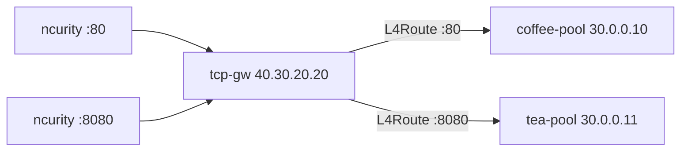

# 3.16 TCPRoute — Listener

Gateway API `TCPRoute` kind 미지원. BNK native: **protocol TCP + L4Route**.  
Kind 는 TCPRoute 가 아니라 **L4Route**.

ncurity 에는 IPIP 가 없습니다. TCP 는 앞단 L4 `vs-bnk` (`ip-protocol tcp`) 가 TMM 으로 IPIP 하므로 ncurity 에서 curl 이 됩니다.

## 구성



## 적용 (마스터)

마스터 `/root/bnk/web/poc/Advanced_Feature/3.16_TCPRoute_Listener`:

```bash
kubectl apply -f gw-tcp-route.yaml
kubectl get gateway tcp-gw -n web
kubectl get l4route -n web
```

**기대 응답**
- Gateway `ADDRESS=40.30.20.20`, `PROGRAMMED=True`
- listener `supportedKinds=L4Route`
- L4Route `Accepted=True`

## 클라이언트 검증 (ncurity)

```bash
curl -sS http://40.30.20.20/
curl -sS http://40.30.20.20:8080/
```

**기대 응답**
- :80 → `COFFEE SERVER - 30.0.0.10`
- :8080 → `TEA SERVER - 30.0.0.11`

## 정리 (마스터)

```bash
kubectl delete -f gw-tcp-route.yaml
```
