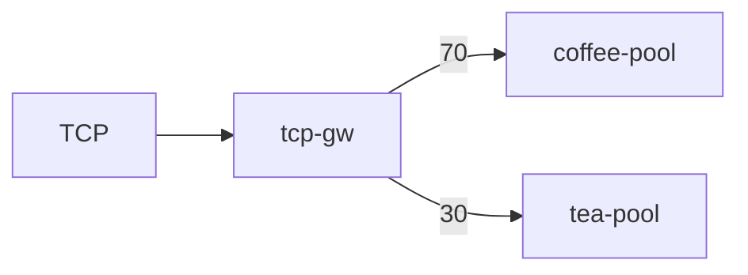

# 3.17 TCPRoute — weight

## 구성



## 적용

```bash
kubectl apply -f gw-tcp-route.yaml
```

명령은 VIP `40.30.20.20` 에 터널로 도달하는 클라이언트에서 실행합니다.

## 클라이언트 검증

### 1. TCP 가중 분배

```bash
for i in $(seq 1 20); do
  echo -e 'GET / HTTP/1.1\r\nHost: x\r\nConnection: close\r\n\r\n' | nc -w 2 40.30.20.20 80
  echo
done | grep -E 'COFFEE|TEA|SERVER' | sort | uniq -c
```

**기대 응답**
- coffee 응답이 더 많음 (약 70/30)

## 정리

```bash
kubectl delete -f gw-tcp-route.yaml
```
