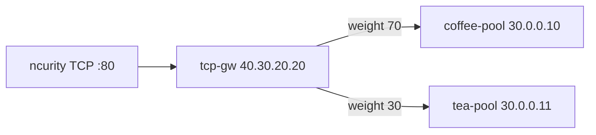

# 3.17 TCPRoute — weight

Gateway API `TCPRoute` kind 미지원. BNK native L4Route `backendRefs.weight` 70/30.  
Kind 는 **L4Route**.

## 구성



## 적용 (마스터)

마스터 `/root/bnk/web/poc/Advanced_Feature/3.17_TCPRoute_Weight`:

```bash
kubectl apply -f gw-tcp-route.yaml
kubectl get gateway tcp-gw -n web
kubectl get l4route -n web
```

**기대 응답**
- Gateway `PROGRAMMED=True`, `supportedKinds=L4Route`
- L4Route coffee `weight: 70`, tea `weight: 30`

## 클라이언트 검증 (ncurity)

한 번의 응답으로는 weight 를 볼 수 없습니다. VIP :80 을 40회 보내고 coffee/tea 횟수를 셉니다.

```bash
for i in $(seq 1 40); do
  curl -sS http://40.30.20.20/
done | sort | uniq -c
```

**기대 응답**
- 각 줄은 `COFFEE SERVER - 30.0.0.10` 또는 `TEA SERVER - 30.0.0.11`
- 비율은 약 70/30. 40회면 반드시 28/12는 아님
- live 결과: coffee **28** / tea **12**
- 40회가 전부 coffee 이면 weight 미적용 (첫 backendRef 만 쓰는 경우와 같음)

## 정리 (마스터)

```bash
kubectl delete -f gw-tcp-route.yaml
```
