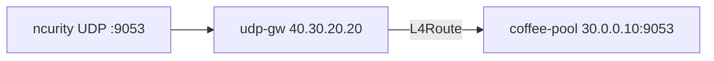

# 3.18 UDPRoute — Listener

Gateway API `UDPRoute` kind 미지원. BNK native: **protocol UDP + L4Route**.  
백엔드 echo 는 **:9053** (호스트 named 가 :53). Kind 는 **L4Route**.

## 구성



## 적용 (마스터)

마스터 `/root/bnk/web/poc/Advanced_Feature/3.18_UDPRoute_Listener`:

```bash
kubectl apply -f gw-udp-route.yaml
kubectl get gateway udp-gw -n web
kubectl get l4route -n web
```

**기대 응답**
- Gateway `ADDRESS=40.30.20.20`, `PROGRAMMED=True`
- listener `supportedKinds=L4Route`
- L4Route `Accepted=True`

## 클라이언트 검증 (ncurity)

```bash
echo -n ping | nc -u -w 2 40.30.20.20 9053; echo
```

**기대 응답:** `COFFEE UDP - 30.0.0.10 ping`

`nc` 가 빈 줄이면:

```bash
timeout 2 bash -c 'exec 3<>/dev/udp/40.30.20.20/9053; echo -n ping >&3; cat <&3; echo'
```

백엔드 직접(선택): `echo -n ping | nc -u -w 2 30.0.0.10 9053; echo` → 동일 문자열.

VIP 앞 L4(`vs-bnk`)가 TCP-only면 ncurity에서 ICMP unreachable/timeout. L4에 UDP VS가 있으면 위 명령으로 확인. TMM debug fallback: `kubectl exec -n f5-bnk-instance "$TMM" -c debug -- bash -c 'exec 3<>/dev/udp/40.30.20.20/9053; printf ping >&3; timeout 2 cat <&3; echo'`

## 정리 (마스터)

```bash
kubectl delete -f gw-udp-route.yaml
```
