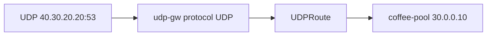

# 3.18 UDPRoute — listener / parentRef

## 구성



## 적용

```bash
kubectl apply -f gw-udp-route.yaml
```

명령은 VIP `40.30.20.20` 에 터널로 도달하는 클라이언트에서 실행합니다.

## 클라이언트 검증

### 1. UDP 전달

```bash
# 백엔드가 DNS면
dig +short @40.30.20.20 -p 53 example.com
# 또는 임의 페이로드
echo -n 'ping' | nc -u -w 2 40.30.20.20 53
```

**기대 응답**
- UDP 패킷이 coffee-pool:80 멤버로 전달 (Pool port는 80으로 되어 있음)
- 백엔드가 UDP를 안 받으면 timeout이 정상
- 연결이 아닌 datagram 전달 여부가 검증 포인트

## 정리

```bash
kubectl delete -f gw-udp-route.yaml
```

## 참고

현재 Pool member port는 80입니다. 실제 UDP 서버 포트가 다르면 Pool port를 맞춰야 합니다.
