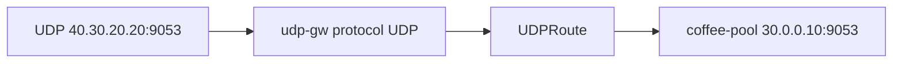

# 3.18 UDPRoute — listener / parentRef

UDP listener 에 UDPRoute 를 붙여 datagram 을 backend 로 보냅니다.  
Pool/listener 포트는 `9053` (`backend/udp/echo.py`). 호스트 `named` 가 이미 :53 을 쓰고 있어 53 은 쓰지 않습니다.

## 구성



## 적용

```bash
kubectl apply -f gw-udp-route.yaml
```

명령은 VIP `40.30.20.20` 에 터널로 도달하는 클라이언트에서 실행합니다.

## 클라이언트 검증

### 1. UDP 전달

```bash
echo -n 'ping' | nc -u -w 2 40.30.20.20 9053
```

**기대 응답**
- echo 가 `COFFEE UDP - 30.0.0.10` (또는 보낸 페이로드 + coffee 식별자)
- 백엔드 echo 가 없으면 timeout. datagram 이 coffee 로 갔는지는 서버 로그로 확인

## 정리

```bash
kubectl delete -f gw-udp-route.yaml
```

## 참고

BNK 2.3 지원 kind 는 L4Route. UDPRoute 는 문서에 없음.  
호스트에는 BIND `named` 가 30.0.0.10/11/12:53 에 이미 listen 중.
