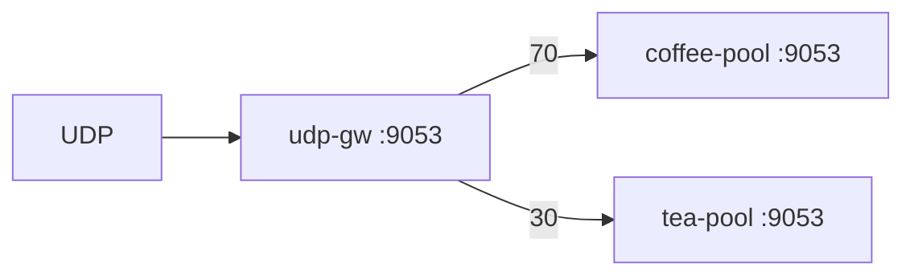

# 3.19 UDPRoute — weight

복수 UDP backendRef 로 datagram 을 비율 분산합니다.

## 구성



## 적용

```bash
kubectl apply -f gw-udp-route.yaml
```

명령은 VIP `40.30.20.20` 에 터널로 도달하는 클라이언트에서 실행합니다.

## 클라이언트 검증

### 1. UDP 가중 분배

```bash
for i in $(seq 1 20); do
  echo -n "ping-$i" | nc -u -w 1 40.30.20.20 9053
  echo
done | sort | uniq -c
```

**기대 응답**
- coffee/tea echo 수신 비율이 약 70/30
- 클라이언트 응답은 echo 구현(`COFFEE UDP` / `TEA UDP`)으로 구분

## 정리

```bash
kubectl delete -f gw-udp-route.yaml
```
