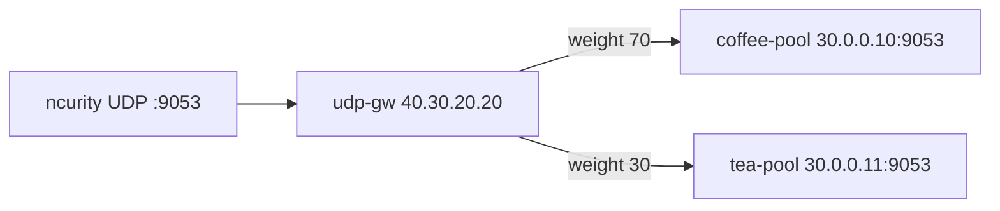

# 3.19 UDPRoute — weight

Gateway API `UDPRoute` kind 미지원. BNK native L4Route `backendRefs.weight` 70/30.  
echo 포트는 3.18 과 같이 **:9053**. Kind 는 **L4Route**.

## 구성



## 적용 (마스터)

마스터 `/root/bnk/web/poc/Advanced_Feature/3.19_UDPRoute_Weight`:

```bash
kubectl apply -f gw-udp-route.yaml
kubectl get gateway udp-gw -n web
kubectl get l4route -n web
```

**기대 응답**
- Gateway `PROGRAMMED=True`, `supportedKinds=L4Route`
- L4Route coffee `weight: 70`, tea `weight: 30`

## 클라이언트 검증 (ncurity)

```bash
for i in $(seq 1 40); do echo -n ping | nc -u -w 2 40.30.20.20 9053; echo; done
```

COFFEE vs TEA 를 센다.

**기대 응답**
- `COFFEE UDP - 30.0.0.10 ping` / `TEA UDP - 30.0.0.11 ping` 약 70/30
- live: coffee **27** / tea **13**
- 전부 coffee 이면 weight 미적용

VIP 앞 L4(`vs-bnk`)가 TCP-only면 ncurity에서 ICMP unreachable/timeout. L4에 UDP VS가 있으면 위 명령으로 확인.

## 정리 (마스터)

```bash
kubectl delete -f gw-udp-route.yaml
```
