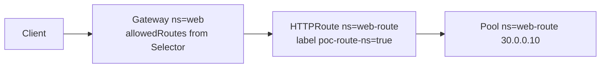

# 3.1 Cross-namespace — Gateway from Selector

다른 namespace Route가 Gateway `allowedRoutes.from: Selector` 로 허용될 때 parentRef 연결을 확인합니다.  
backend Pool은 Route와 같은 `web-route` 에 둡니다 (3.2 ReferenceGrant와 분리).

## 구성



## 사전 준비

YAML이 Namespace `web-route` 를 생성합니다.

## 적용

```bash
kubectl apply -f gw-http-route.yaml
```

명령은 VIP `40.30.20.20` 에 터널로 도달하는 클라이언트에서 실행합니다.

## 클라이언트 검증

### 1. 다른 ns Route가 Gateway에 붙음

```bash
curl --resolve coffee.f5bnk.com:80:40.30.20.20 http://coffee.f5bnk.com/
```

**기대 응답**
- HTTP/1.1 200
- Body: `COFFEE SERVER - 30.0.0.10`
- `kubectl get httproute -n web-route` Accepted=True

### 2. Selector 확인

```bash
kubectl get ns web-route --show-labels; kubectl get gateway http-gw -n web -o yaml | grep -A8 allowedRoutes
```

**기대 응답**
- web-route 에 `poc-route-ns=true`
- Gateway from: Selector

## 정리

```bash
kubectl delete -f gw-http-route.yaml
```

## 참고

BNK 2.3 Gateway 문서: `allowedRoutes.namespaces.from` 은 All/Same 만 지원, Selector 는 미지원.  
Selector가 거절되면 Listener `InvalidRouteKinds` / Route Accepted=False 가 정상이다.
