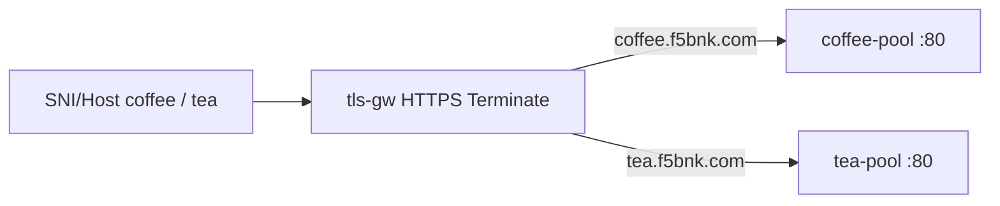

# 3.3 TLSRoute — hostname SNI

TLSRoute / protocol TLS 는 BNK에서 미지원.  
BNK native 시도: HTTPS listener `hostname:` + Secret 두 개 (coffee / tea) 와 HTTPRoute hostnames.

## 구성



## 적용

```bash
kubectl apply -f gw-tls-route.yaml
```

## 클라이언트 검증

```bash
echo | openssl s_client -connect 40.30.20.20:443 -servername coffee.f5bnk.com 2>/dev/null | openssl x509 -noout -subject
echo | openssl s_client -connect 40.30.20.20:443 -servername tea.f5bnk.com 2>/dev/null | openssl x509 -noout -subject
curl -k --resolve coffee.f5bnk.com:443:40.30.20.20 https://coffee.f5bnk.com/
curl -k --resolve tea.f5bnk.com:443:40.30.20.20 https://tea.f5bnk.com/
```

**live 결과 (재검증)**
- HTTP Host 라우팅: coffee → `COFFEE SERVER - 30.0.0.10`, tea → `TEA SERVER - 30.0.0.11`
- SNI 인증서 선택: 두 SNI 모두 `CN=tea.f5bnk.com` (listener hostname SNI 미적용, last-wins)

## 정리

```bash
kubectl delete -f gw-tls-route.yaml
```
