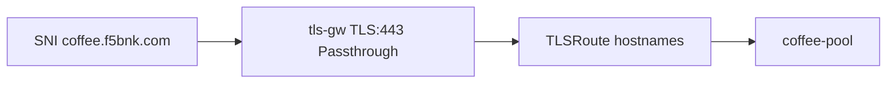

# 3.3 TLSRoute — hostname SNI

## 구성



## 적용

```bash
kubectl apply -f gw-tls-route.yaml
```

명령은 VIP `40.30.20.20` 에 터널로 도달하는 클라이언트에서 실행합니다.

## 클라이언트 검증

### 1. 올바른 SNI

```bash
openssl s_client -connect 40.30.20.20:443 -servername coffee.f5bnk.com -brief </dev/null
# 또는
curl -k --resolve coffee.f5bnk.com:443:40.30.20.20 https://coffee.f5bnk.com/
```

**기대 응답**
- SNI `coffee.f5bnk.com` 이 TLSRoute에 매칭되어 coffee-pool로 passthrough
- 백엔드가 TLS를 종료하면 HTTPS 200 + coffee body

### 2. 다른 SNI

```bash
openssl s_client -connect 40.30.20.20:443 -servername other.example.com -brief </dev/null
```

**기대 응답**
- 매칭 실패. 핸드셰이크 실패 또는 연결 종료

## 정리

```bash
kubectl delete -f gw-tls-route.yaml
```

## 참고

Passthrough라서 Gateway는 인증서를 갖지 않습니다. 백엔드가 TLS 서버여야 합니다.
