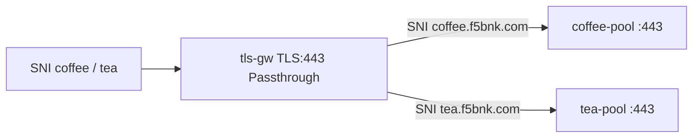

# 3.3 TLSRoute — hostname SNI

TLS ClientHello SNI 로 backend 를 고릅니다. Listener hostname 은 비워 두고 TLSRoute `hostnames` 가 SNI 매칭을 합니다.

백엔드는 TLS :443 (`backend/conf.d/coffee-tls.conf`, `tea-tls.conf`). HTTP :80 으로는 passthrough 가 성립하지 않습니다.

## 구성



## 적용

```bash
kubectl apply -f gw-tls-route.yaml
```

명령은 VIP `40.30.20.20` 에 터널로 도달하는 클라이언트에서 실행합니다.

## 클라이언트 검증

### 1. 일치 SNI → coffee

```bash
curl -k --resolve coffee.f5bnk.com:443:40.30.20.20 https://coffee.f5bnk.com/
```

**기대 응답**
- 백엔드 coffee 인증서 (SAN `coffee.f5bnk.com`)
- Body: `COFFEE TLS - 30.0.0.10`

### 2. 일치 SNI → tea

```bash
curl -k --resolve tea.f5bnk.com:443:40.30.20.20 https://tea.f5bnk.com/
```

**기대 응답**
- 백엔드 tea 인증서 (SAN `tea.f5bnk.com`)
- Body: `TEA TLS - 30.0.0.11`

### 3. 불일치 SNI

```bash
openssl s_client -connect 40.30.20.20:443 -servername other.example.com -brief </dev/null
```

**기대 응답**
- 매칭 실패. 핸드셰이크 실패 또는 연결 종료

## 정리

```bash
kubectl delete -f gw-tls-route.yaml
```

## 참고

BNK 2.3: 지원 Route kind 는 HTTPRoute / GRPCRoute / L4Route. protocol TLS · TLSRoute 는 문서에 없음. Listener hostname 도 미지원.
