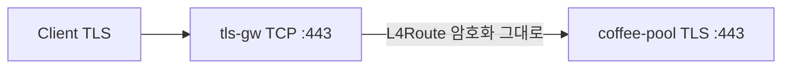

# 3.4 TLSRoute — Passthrough

Gateway API `kind: TLSRoute` / listener `protocol: TLS` 는 BNK에서 미지원.  
BNK native는 **TCP :443 + L4Route** 로 암호화 stream을 백엔드 TLS :443에 그대로 전달한다.  
client가 보는 인증서는 Gateway Secret이 아니라 백엔드 `coffee.crt`.

## 구성



## 적용

```bash
kubectl apply -f gw-tls-route.yaml
```

명령은 VIP `40.30.20.20` 에 터널로 도달하는 클라이언트에서 실행합니다.

## 클라이언트 검증

### 1. e2e TLS — 백엔드 인증서

```bash
echo | openssl s_client -connect 40.30.20.20:443 -servername coffee.f5bnk.com -showcerts 2>/dev/null | openssl x509 -noout -subject -ext subjectAltName -fingerprint -sha256
curl -k --resolve coffee.f5bnk.com:443:40.30.20.20 https://coffee.f5bnk.com/
```

**기대 응답**
- subject/SAN `coffee.f5bnk.com`, fingerprint = 백엔드 `/etc/nginx/poc-certs/coffee.crt`
- Body: `COFFEE TLS - 30.0.0.10`
- HTTP :80 은 이 Gateway에 없음 (timeout)

## 정리

```bash
kubectl delete -f gw-tls-route.yaml
```
