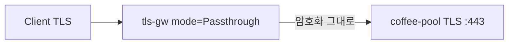

# 3.4 TLSRoute — Passthrough

Gateway가 TLS를 종료하지 않고 암호화 stream을 backend로 전달합니다.  
coffee-pool 은 TLS :443 이어야 하고, client가 보는 인증서는 Gateway Secret이 아니라 백엔드 인증서입니다.

## 구성



## 적용

```bash
kubectl apply -f gw-tls-route.yaml
```

명령은 VIP `40.30.20.20` 에 터널로 도달하는 클라이언트에서 실행합니다.

## 클라이언트 검증

### 1. e2e TLS

```bash
echo | openssl s_client -connect 40.30.20.20:443 -servername coffee.f5bnk.com -showcerts 2>/dev/null | openssl x509 -noout -subject -ext subjectAltName
curl -k --resolve coffee.f5bnk.com:443:40.30.20.20 https://coffee.f5bnk.com/
```

**기대 응답**
- subject/SAN 이 `coffee.f5bnk.com` (백엔드 인증서). Gateway `web-tls-cert` 가 아님
- HTTP/1.1 200
- Body: `COFFEE TLS - 30.0.0.10`

## 정리

```bash
kubectl delete -f gw-tls-route.yaml
```
