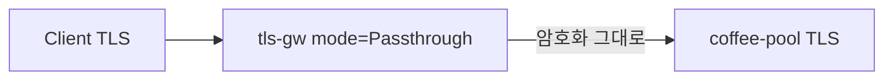

# 3.4 TLSRoute — Passthrough

## 구성



## 적용

```bash
kubectl apply -f gw-tls-route.yaml
```

명령은 VIP `40.30.20.20` 에 터널로 도달하는 클라이언트에서 실행합니다.

## 클라이언트 검증

### 1. e2e TLS

```bash
curl -k --resolve coffee.f5bnk.com:443:40.30.20.20 https://coffee.f5bnk.com/
```

**기대 응답**
- Gateway가 TLS를 종료하지 않음. 백엔드 인증서가 보임 (`openssl s_client` 로 확인)
- 백엔드가 TLS면 200 + coffee body

## 정리

```bash
kubectl delete -f gw-tls-route.yaml
```
