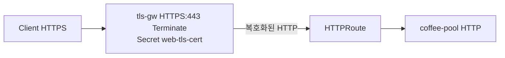

# 3.5 TLS — Terminate + HTTPRoute

## 구성



## 사전 준비

`web` 네임스페이스에 TLS Secret `web-tls-cert` 가 있어야 합니다.

```bash
kubectl create secret tls web-tls-cert -n web --cert=tls.crt --key=tls.key
```

## 적용

```bash
kubectl apply -f gw-http-route.yaml
```

명령은 VIP `40.30.20.20` 에 터널로 도달하는 클라이언트에서 실행합니다.

## 클라이언트 검증

### 1. Terminate 후 HTTP 전달

```bash
curl -k --resolve coffee.f5bnk.com:443:40.30.20.20 https://coffee.f5bnk.com/
```

**기대 응답**
- HTTPS 핸드셰이크 성공 (인증서는 web-tls-cert)
- HTTP/1.1 200
- Body: `COFFEE SERVER - 30.0.0.10`

### 2. HTTP 80으로는 이 Listener 안 씀

```bash
curl --resolve coffee.f5bnk.com:80:40.30.20.20 http://coffee.f5bnk.com/
```

**기대 응답**
- 이 테스트 Gateway는 443 HTTPS만 있음. 80은 매칭 안 됨

## 정리

```bash
kubectl delete -f gw-http-route.yaml
```
