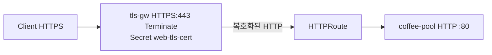

# 3.5 TLS — Terminate + HTTPRoute

Gateway에서 TLS를 종료한 뒤 HTTP 로 backend에 전달합니다.  
Gateway API TLS Terminate 가이드는 HTTPS listener + HTTPRoute 입니다 (TLSRoute Terminate는 복호화 후 raw TCP).

Secret `web-tls-cert` 는 YAML에 포함되어 있습니다 (`backend/certs/gw-terminate.*`).

## 구성



## 적용

```bash
kubectl apply -f gw-http-route.yaml
```

명령은 VIP `40.30.20.20` 에 터널로 도달하는 클라이언트에서 실행합니다.

## 클라이언트 검증

### 1. Terminate 후 HTTP 전달

```bash
echo | openssl s_client -connect 40.30.20.20:443 -servername coffee.f5bnk.com 2>/dev/null | openssl x509 -noout -subject
curl -k --resolve coffee.f5bnk.com:443:40.30.20.20 https://coffee.f5bnk.com/
```

**기대 응답**
- 인증서는 Gateway Secret (`CN=coffee.f5bnk.com`). 백엔드 `COFFEE TLS` 인증서가 아님
- HTTP/1.1 200
- Body: `COFFEE SERVER - 30.0.0.10` (plain HTTP :80)

### 2. HTTP 80으로는 이 Listener 안 씀

```bash
curl --resolve coffee.f5bnk.com:80:40.30.20.20 http://coffee.f5bnk.com/
```

**기대 응답**
- 이 테스트 Gateway는 443 HTTPS만 있음. 80은 매칭 안 됨

## 정리

```bash
kubectl delete -f gw-http-route.yaml
```

## 참고

BNK 2.3: listener TLS(HTTPS) + HTTPRoute 는 지원. protocol TLS / TLSRoute 는 문서에 없음.
