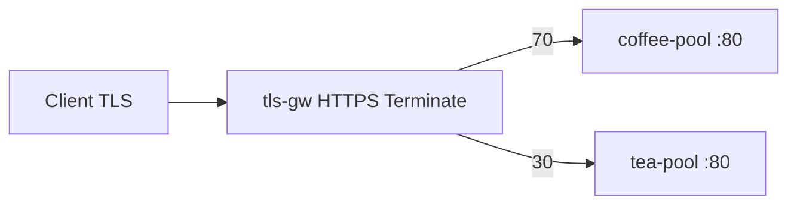

# 3.6 TLSRoute — weight

TLSRoute 미지원. BNK native: HTTPS Terminate + HTTPRoute `backendRefs.weight` 70/30.

## 구성



## 적용

```bash
kubectl apply -f gw-tls-route.yaml
```

## 클라이언트 검증

```bash
for i in $(seq 1 40); do
  curl -sk --resolve coffee.f5bnk.com:443:40.30.20.20 https://coffee.f5bnk.com/
  echo
done | sort | uniq -c
```

**live 결과:** 40회 → coffee 28 / tea 12 (70/30)

## 정리

```bash
kubectl delete -f gw-tls-route.yaml
```
