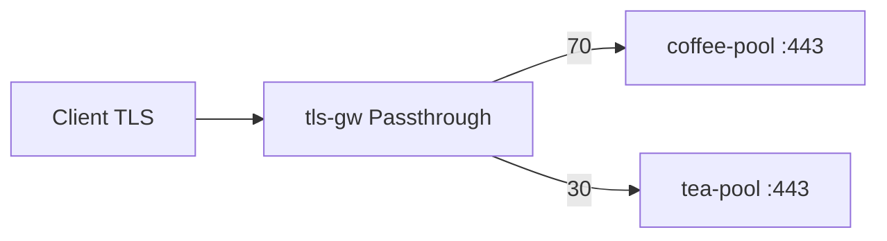

# 3.6 TLSRoute — weight

동일 SNI 반복 연결을 backendRefs.weight 로 나눕니다. 백엔드는 TLS :443.

## 구성



## 적용

```bash
kubectl apply -f gw-tls-route.yaml
```

명령은 VIP `40.30.20.20` 에 터널로 도달하는 클라이언트에서 실행합니다.

## 클라이언트 검증

### 1. 가중 분배

```bash
for i in $(seq 1 20); do
  curl -sk --resolve coffee.f5bnk.com:443:40.30.20.20 https://coffee.f5bnk.com/
  echo
done | sort | uniq -c
```

**기대 응답**
- coffee 쪽이 더 많음 (약 70/30)
- Body: `COFFEE TLS - 30.0.0.10` / `TEA TLS - 30.0.0.11`

## 정리

```bash
kubectl delete -f gw-tls-route.yaml
```
