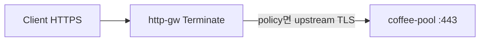

# 3.7 BackendTLSPolicy — hostname / subjectAltNames

HTTPS Terminate + BackendTLSPolicy (재암호화) 와 HTTP listener + policy 둘 다 재검증.  
Pool member 는 TLS :443. CA 는 ConfigMap `backend-ca`.

## 구성



## 적용

```bash
kubectl apply -f gw-backend-tls.yaml
```

## live 결과

- CRD `backendtlspolicies.gateway.networking.k8s.io` 존재
- policy `status=` 비어 있음. events 없음. f5-cne-controller 로그에 BackendTLS 없음
- Gateway는 pool :443 에 **plain HTTP** → nginx `400 The plain HTTP request was sent to HTTPS port`
- SAN match/mismatch를 검증할 수 없음 (upstream TLS 자체가 없음)
- iRule 카탈로그에 BackendTLSPolicy 없음

## 정리

```bash
kubectl delete -f gw-backend-tls.yaml
```
