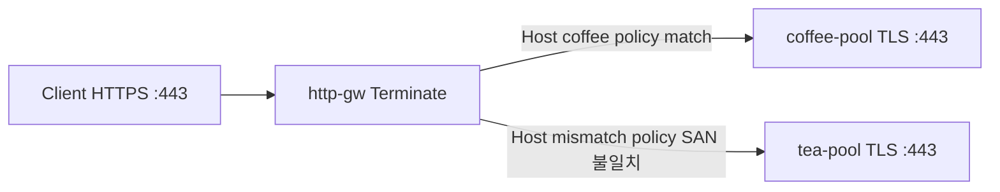

# 3.7 BackendTLSPolicy — hostname / subjectAltNames

upstream TLS SNI와 서버 인증서 hostname/SAN을 검증한다.  
Gateway는 클라이언트 TLS를 Terminate한 뒤, Pool `:443` 으로 다시 TLS(재암호화)해야 한다.

공식: https://gateway-api.sigs.k8s.io/reference/api-types/policy/backendtlspolicy/

| Host | Pool | Policy hostname/SAN | 백엔드 인증서 |
|---|---|---|---|
| coffee.f5bnk.com | coffee-pool `30.0.0.10:443` | coffee.f5bnk.com | 일치 |
| mismatch.f5bnk.com | tea-pool `30.0.0.11:443` | coffee.f5bnk.com | 불일치 (`tea.f5bnk.com`) |

CA는 ConfigMap `backend-ca` (poc-backend-ca).

## 왜 Gateway는 Programmed인데 server-side TLS가 없는가

시트 비고의 **「CRD 있음」은 F5 대체 CRD가 아니라** 클러스터에 Gateway API `BackendTLSPolicy` CRD가 설치돼 있다는 뜻이다. YAML은 apply되고 객체는 남지만, BNK 컨트롤러가 이 policy를 **reconcile하지 않는다**.

- VS는 `Gateway` + `HTTPRoute` 만으로 만들어진다. `Programmed=True` 는 **클라이언트 TLS Terminate**(또는 HTTP listener)가 올라갔다는 뜻이다.
- F5 문서: listener `tls` 는 **client-side SSL만**. `BackendTLSPolicy is not supported`. Known issue 1849541 — 컨트롤러가 BackendTLSPolicy 이벤트를 처리하지 않음.
  - https://clouddocs.f5.com/bigip-next-for-kubernetes/latest/custom-resource-definitions/bnk-gateway-api-gateway.html
- 그래서 VS → pool `:443` 은 **plain HTTP**. nginx `400 The plain HTTP request was sent to HTTPS port`.
- 3.4 TCPRoute처럼 쓸 F5 대체 CRD는 **없다**. `L4Route` 는 L4 패스스루이지 Gateway가 재암호화·SAN/CA 검증하는 경로가 아니다. `Pool` spec에도 TLS 필드가 없고, `F5BigServerSslSetting` / `F5SPKIngressHTTP2` CRD는 이 클러스터에 설치되어 있지 않다. 그래서 `*-v2.yaml` 은 작성하지 않는다.

확인: `kubectl get backendtlspolicy -n web -o yaml` 의 `status` 가 비어 있으면 컨트롤러가 무시한 것이다.

## 구성



## 적용

```bash
kubectl apply -f gw-backend-tls.yaml
```

명령은 VIP `40.30.20.20` 에 터널로 도달하는 클라이언트에서 실행한다.

## 객체 확인

```bash
kubectl get gateway,httproute,backendtlspolicy,pool -n web
kubectl get backendtlspolicy -n web -o yaml
kubectl describe backendtlspolicy coffee-backend-tls-match -n web
kubectl describe backendtlspolicy tea-backend-tls-mismatch -n web
```

확인할 것:

- Gateway `Programmed=True`, HTTPRoute `Accepted=True`
- BackendTLSPolicy `status` / conditions (Accepted, 오류 메시지)
- status가 비어 있으면 컨트롤러가 policy를 안 붙인 것

## 클라이언트 검증

### 1. SAN 일치 — coffee

```bash
curl -vk --resolve coffee.f5bnk.com:443:40.30.20.20 \
  https://coffee.f5bnk.com/
```

**기대 (policy 적용 시)**
- 클라이언트 인증서는 Gateway Secret (`CN=coffee.f5bnk.com`)
- HTTP 200
- Body: `COFFEE TLS - 30.0.0.10`

### 2. SAN 불일치 — mismatch → tea-pool

```bash
curl -vk --resolve mismatch.f5bnk.com:443:40.30.20.20 \
  https://mismatch.f5bnk.com/
```

**기대 (policy 적용 시)**
- fail-close. 502/503 또는 연결 실패. `COFFEE TLS` / `TEA TLS` body가 오면 안 됨
- mismatch policy status에 검증 실패가 보여야 함

### 3. policy가 안 붙었을 때 (미구현)

```bash
curl -vk --resolve coffee.f5bnk.com:443:40.30.20.20 \
  https://coffee.f5bnk.com/
curl -vk --resolve mismatch.f5bnk.com:443:40.30.20.20 \
  https://mismatch.f5bnk.com/
```

Gateway가 pool `:443` 에 plain HTTP를 보내면 nginx가 이렇게 응답한다.

```text
400 Bad Request
The plain HTTP request was sent to HTTPS port
```

이 400이면 SAN match/mismatch를 평가하기 전 단계다. status가 비어 있는 것과 같이 보면 된다.

## 정리

```bash
kubectl delete -f gw-backend-tls.yaml
```

iRule로는 불가. iRule은 백엔드 TLS 핸드셰이크를 열고 hostname/SAN을 검증하거나 CA bundle을 제시할 수 없다. 재암호화는 VS server-ssl 프로파일/컨트롤러 영역이며, `SSL::*`로 BackendTLSPolicy를 대체하지 않는다.
