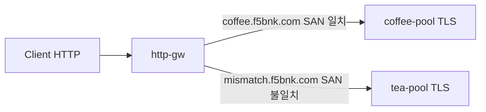

# 3.7 BackendTLSPolicy — hostname / subjectAltNames

upstream TLS SNI(`hostname`)와 서버 인증서 SAN(`subjectAltNames`)을 검증합니다.  
CA 는 3.8과 같은 ConfigMap `backend-ca` 를 써서 hostname/SAN 만 변수로 둡니다 (System CA 는 3.9).

Pool member 는 TLS :443.

## 구성



## 적용

```bash
kubectl apply -f gw-backend-tls.yaml
```

명령은 VIP `40.30.20.20` 에 터널로 도달하는 클라이언트에서 실행합니다.

## 클라이언트 검증

### 1. hostname/SAN 일치

```bash
curl --resolve coffee.f5bnk.com:80:40.30.20.20 http://coffee.f5bnk.com/
```

**기대 응답**
- 200 + `COFFEE TLS - 30.0.0.10`
- policy `coffee-backend-tls-match` hostname/SAN = `coffee.f5bnk.com`

### 2. hostname/SAN 불일치 fail-close

```bash
curl --resolve mismatch.f5bnk.com:80:40.30.20.20 http://mismatch.f5bnk.com/
```

**기대 응답**
- tea 인증서 SAN 은 `tea.f5bnk.com` 인데 policy 는 `coffee.f5bnk.com` → fail-close (502/503)
- `kubectl get backendtlspolicy tea-backend-tls-mismatch -n web -o yaml` status 오류

## 정리

```bash
kubectl delete -f gw-backend-tls.yaml
```

## 참고

BNK 2.3 Gateway 문서: BackendTLSPolicy is not supported. 컨트롤러가 이벤트를 처리하지 않으면 policy status 가 비어 있는 것이 문서와 맞다.
