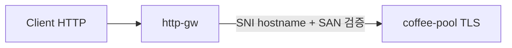

# 3.7 BackendTLSPolicy — hostname / subjectAltNames

upstream TLS SNI(`hostname`)와 서버 인증서 hostname/SAN(`subjectAltNames`)을 검증합니다.

## 구성



## 적용

```bash
kubectl apply -f gw-backend-tls.yaml
```

명령은 VIP `40.30.20.20` 에 터널로 도달하는 클라이언트에서 실행합니다.

## 클라이언트 검증

### 1. hostname/SAN 일치

```bash
curl --resolve coffee.f5bnk.com:80:40.30.20.20 http://coffee.f5bnk.com/
```

**기대 응답**
- 인증서 hostname/SAN이 `coffee.f5bnk.com` 이면 200 + coffee
- 불일치면 fail-close (502/503)
- 백엔드가 plain HTTP면 TLS 핸드셰이크 실패

### 2. 정책 상태

```bash
kubectl get backendtlspolicy coffee-backend-tls -n web -o yaml
```

**기대 응답**
- `validation.hostname: coffee.f5bnk.com`
- `validation.subjectAltNames` 에 Hostname `coffee.f5bnk.com`
- 불일치 시 policy status 오류

## 정리

```bash
kubectl delete -f gw-backend-tls.yaml
```
