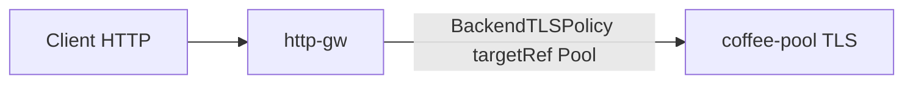

# 3.7 BackendTLSPolicy — targetRef

## 구성



## 적용

```bash
kubectl apply -f gw-backend-tls.yaml
```

명령은 VIP `40.30.20.20` 에 터널로 도달하는 클라이언트에서 실행합니다.

## 클라이언트 검증

### 1. 정책 적용 후 HTTP 클라이언트

```bash
curl -sS -D - -o /tmp/gw-body  -H 'Host: coffee.f5bnk.com' http://40.30.20.20/; echo; echo '--- body ---'; cat /tmp/gw-body; echo
```

**기대 응답**
- 정책이 붙으면 Gateway→백엔드가 TLS
- 백엔드가 TLS+System CA로 검증되면 200 + coffee
- 백엔드가 plain HTTP면 TLS 핸드셰이크 실패

### 2. 정책 상태

```bash
kubectl get backendtlspolicy coffee-backend-tls -n web -o yaml | sed -n '/status:/,$p'
```

**기대 응답**
- targetRefs.kind=Pool, name=coffee-pool
- Accepted 조건 확인

## 정리

```bash
kubectl delete -f gw-backend-tls.yaml
```
