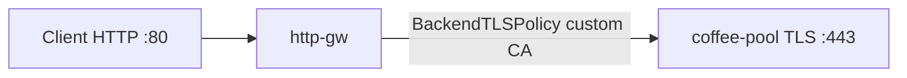

# 3.8 BackendTLSPolicy — caCertificateRefs

ConfigMap에 넣은 CA bundle로 upstream 서버 인증서를 검증한다.  
클라이언트는 HTTP `:80`. Gateway가 coffee-pool `:443` 으로 TLS를 걸어야 한다.

공식: https://gateway-api.sigs.k8s.io/reference/api-types/policy/backendtlspolicy/

| 항목 | 값 |
|---|---|
| Client | `http://coffee.f5bnk.com/` (VIP :80) |
| Pool | `30.0.0.10:443` (사설 `coffee.crt`, issuer poc-backend-ca) |
| CA | ConfigMap `backend-ca` (`ca.crt`) |
| Policy hostname | coffee.f5bnk.com |

## 왜 Gateway는 Programmed인데 server-side TLS가 없는가

시트 **「CRD 있음」은 Gateway API `BackendTLSPolicy` CRD가 설치돼 있어 apply가 된다는 뜻**이지, F5가 upstream TLS를 구현했다는 뜻이 아니다.

- VS는 Gateway + HTTPRoute로 생긴다. `Programmed=True` 는 HTTP `:80` VIP가 올라간 것이다.
- BNK는 `BackendTLSPolicy` 미지원 (공식 Gateway 문서, known issue 1849541). policy `status` 비어 있음 = 컨트롤러 미처리.
- VS가 pool `:443` 에 TLS를 안 걸고 plain HTTP를 보내면 `400 The plain HTTP request was sent to HTTPS port`.
- 3.4의 `L4Route` 같은 대체 CRD는 없다. `Pool` 에 TLS 필드 없음. `F5BigServerSslSetting` CRD 미설치. `*-v2.yaml` 없음.

https://clouddocs.f5.com/bigip-next-for-kubernetes/latest/custom-resource-definitions/bnk-gateway-api-gateway.html

## 구성



## 적용

```bash
kubectl apply -f gw-backend-tls.yaml
```

명령은 VIP `40.30.20.20` 에 터널로 도달하는 클라이언트에서 실행한다.

## 객체 확인

```bash
kubectl get gateway,httproute,backendtlspolicy,configmap,pool -n web
kubectl get backendtlspolicy coffee-backend-tls-ca -n web -o yaml
kubectl describe backendtlspolicy coffee-backend-tls-ca -n web
```

확인할 것:

- HTTPRoute `Accepted=True`, Gateway `Programmed=True`
- BackendTLSPolicy `status` 에 Accepted / 오류
- ConfigMap `backend-ca` 에 `ca.crt` 존재
- status가 비어 있으면 컨트롤러가 policy를 안 붙인 것

## 클라이언트 검증

### 1. 지정 CA로 upstream 검증 성공

```bash
curl -v --resolve coffee.f5bnk.com:80:40.30.20.20 \
  http://coffee.f5bnk.com/
```

**기대 (policy 적용 시)**
- HTTP 200
- Body: `COFFEE TLS - 30.0.0.10`
- 400이 아니어야 한다 (upstream이 TLS여야 함)

### 2. policy가 안 붙었을 때 (미구현)

같은 curl에서 nginx가 이렇게 응답하면 Gateway가 `:443` 에 plain HTTP를 보낸 것이다. CA 검증은 실행되지 않은 것.

```text
400 Bad Request
The plain HTTP request was sent to HTTPS port
```

## 정리

```bash
kubectl delete -f gw-backend-tls.yaml
```
