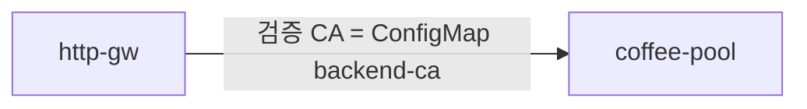

# 3.8 BackendTLSPolicy — caCertificates

## 구성



## 사전 준비

`web` 에 ConfigMap `backend-ca` (`ca.crt` 키)가 필요합니다.

```bash
kubectl create configmap backend-ca -n web --from-file=ca.crt=./ca.crt
```

## 적용

```bash
kubectl apply -f gw-backend-tls.yaml
```

명령은 VIP `40.30.20.20` 에 터널로 도달하는 클라이언트에서 실행합니다.

## 클라이언트 검증

### 1. 커스텀 CA

```bash
curl -sS -D - -o /tmp/gw-body  -H 'Host: coffee.f5bnk.com' http://40.30.20.20/; echo; echo '--- body ---'; cat /tmp/gw-body; echo
```

**기대 응답**
- ConfigMap `backend-ca` 의 ca.crt 로 백엔드 인증서 검증
- 검증 성공 시 200 + coffee, 실패 시 502/503

### 2. 리소스

```bash
kubectl get configmap backend-ca -n web; kubectl get backendtlspolicy -n web
```

**기대 응답**
- backend-ca, BackendTLSPolicy 존재

## 정리

```bash
kubectl delete -f gw-backend-tls.yaml
```
