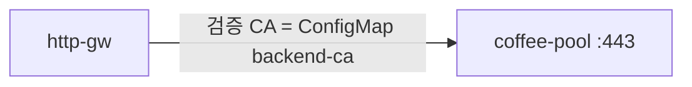

# 3.8 BackendTLSPolicy — caCertificateRefs

ConfigMap `backend-ca` (`ca.crt`) 로 upstream 서버 인증서를 검증합니다. ConfigMap 은 YAML에 포함되어 있습니다.

## 구성



## 적용

```bash
kubectl apply -f gw-backend-tls.yaml
```

명령은 VIP `40.30.20.20` 에 터널로 도달하는 클라이언트에서 실행합니다.

## 클라이언트 검증

### 1. 지정 CA 로 검증

```bash
curl --resolve coffee.f5bnk.com:80:40.30.20.20 http://coffee.f5bnk.com/
```

**기대 응답**
- ConfigMap `backend-ca` 의 ca.crt 가 coffee 인증서를 검증하면 200 + `COFFEE TLS - 30.0.0.10`
- 잘못된 CA 로 바꾸면 502/503

### 2. 리소스

```bash
kubectl get configmap backend-ca -n web; kubectl get backendtlspolicy -n web
```

**기대 응답**
- backend-ca, BackendTLSPolicy 존재

## 정리

```bash
kubectl delete -f gw-backend-tls.yaml
```

## 참고

`caCertificateRefs` 와 `wellKnownCACertificates` 는 동시에 쓸 수 없다 (CRD CEL).  
BNK 2.3: BackendTLSPolicy is not supported.
