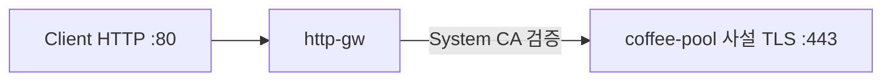

# 3.9 BackendTLSPolicy — wellKnownCACertificates: System

구현체의 system trust store로 upstream 인증서를 검증한다.  
이 YAML의 백엔드는 사설 `poc-backend-ca` 이라 System CA에는 없다. 구현됐다면 **실패**여야 한다.

공식: https://gateway-api.sigs.k8s.io/reference/api-types/policy/backendtlspolicy/

| 항목 | 값 |
|---|---|
| Client | `http://coffee.f5bnk.com/` (VIP :80) |
| Pool | `30.0.0.10:443` (사설 coffee.crt) |
| Policy | `wellKnownCACertificates: System` |
| hostname | coffee.f5bnk.com |

공인 인증서 백엔드는 이 PoC에 없다. 사설 인증서 fail-close만 확인한다.

## 왜 Gateway는 Programmed인데 server-side TLS가 없는가

시트 **「CRD 있음」은 Gateway API `BackendTLSPolicy` CRD가 설치돼 있어 apply가 된다는 뜻**이지, System CA 검증이 돈다는 뜻이 아니다.

- VS는 Gateway + HTTPRoute로 생긴다. `Programmed=True` 는 HTTP `:80` VIP가 올라간 것이다.
- BNK는 `BackendTLSPolicy` 미지원. `wellKnownCACertificates: System` 도 컨트롤러가 읽지 않는다.
- VS가 pool `:443` 에 plain HTTP를 보내면 `400 The plain HTTP request was sent to HTTPS port`. 이 400은 System CA 실패가 아니라 **upstream TLS 자체 미설정**.
- F5 대체 CRD 없음 (`Pool` TLS 필드 없음, `F5BigServerSslSetting` 미설치). `*-v2.yaml` 없음.

https://clouddocs.f5.com/bigip-next-for-kubernetes/latest/custom-resource-definitions/bnk-gateway-api-gateway.html

## 구성



## 적용

```bash
kubectl apply -f gw-backend-tls.yaml
```

명령은 VIP `40.30.20.20` 에 터널로 도달하는 클라이언트에서 실행한다.

## 객체 확인

```bash
kubectl get gateway,httproute,backendtlspolicy,pool -n web
kubectl get backendtlspolicy coffee-backend-tls-system -n web -o yaml
kubectl describe backendtlspolicy coffee-backend-tls-system -n web
```

확인할 것:

- HTTPRoute `Accepted=True`, Gateway `Programmed=True`
- BackendTLSPolicy `status` (Accepted, 인증서 검증 실패 메시지)
- status가 비어 있으면 컨트롤러가 policy를 안 붙인 것

## 클라이언트 검증

### 1. 사설 인증서 + System CA — 실패여야 함

```bash
curl -v --resolve coffee.f5bnk.com:80:40.30.20.20 \
  http://coffee.f5bnk.com/
```

**기대 (policy 적용 시)**
- fail-close. 502/503 또는 연결 실패
- Body에 `COFFEE TLS` 가 오면 System CA 검증이 안 된 것
- policy status에 trust/검증 실패가 보여야 함

### 2. policy가 안 붙었을 때 (미구현)

같은 curl에서 nginx가 이렇게 응답하면 Gateway가 `:443` 에 plain HTTP를 보낸 것이다. System CA 검증 전 단계다.

```text
400 Bad Request
The plain HTTP request was sent to HTTPS port
```

## 정리

```bash
kubectl delete -f gw-backend-tls.yaml
```

iRule로는 불가. system trust store(`wellKnownCACertificates: System`)는 TMM/OS CA 저장소이고, iRule이 그 저장소로 백엔드 인증서를 검증하지 않는다.
