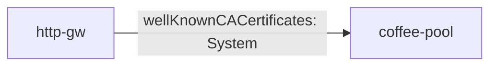

# 3.9 BackendTLSPolicy — System CA

## 구성



## 적용

```bash
kubectl apply -f gw-backend-tls.yaml
```

명령은 VIP `40.30.20.20` 에 터널로 도달하는 클라이언트에서 실행합니다.

## 클라이언트 검증

### 1. System CA 검증

```bash
curl --resolve coffee.f5bnk.com:80:40.30.20.20 http://coffee.f5bnk.com/
```

**기대 응답**
- 공인/시스템 CA로 검증. 사설 인증서면 실패가 정상
- 공인 인증서 백엔드면 200 + coffee

## 정리

```bash
kubectl delete -f gw-backend-tls.yaml
```
