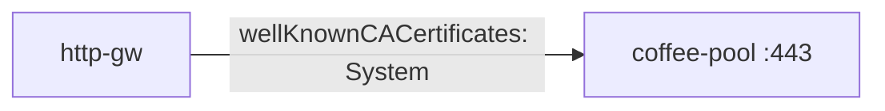

# 3.9 BackendTLSPolicy — wellKnownCACertificates: System

구현체 system trust store 로 upstream 인증서를 검증합니다.  
PoC coffee 인증서는 사설 CA 서명이므로 System 검증은 실패가 정상입니다.

## 구성



## 적용

```bash
kubectl apply -f gw-backend-tls.yaml
```

명령은 VIP `40.30.20.20` 에 터널로 도달하는 클라이언트에서 실행합니다.

## 클라이언트 검증

### 1. System CA 검증

```bash
curl --resolve coffee.f5bnk.com:80:40.30.20.20 http://coffee.f5bnk.com/
```

**기대 응답**
- 사설 인증서면 fail-close (502/503) 가 정상
- 공인 인증서 백엔드면 200 (이 PoC 호스트에는 공인 인증서 백엔드 없음)

## 정리

```bash
kubectl delete -f gw-backend-tls.yaml
```

## 참고

BNK 2.3: BackendTLSPolicy is not supported.
