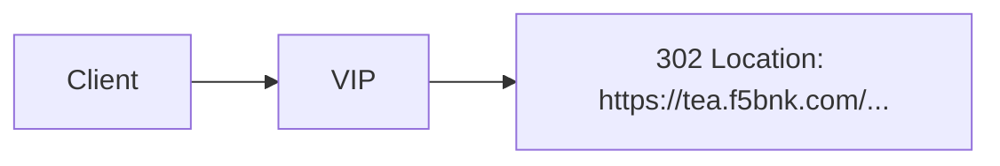

# 2.12 HTTP Redirect — statusCode

## 구성



## 적용

```bash
kubectl apply -f gw-http-route.yaml
```

명령은 VIP `40.30.20.20` 에 터널로 도달하는 클라이언트에서 실행합니다.

## 클라이언트 검증

### 1. 302 + hostname

```bash
curl --resolve coffee.f5bnk.com:80:40.30.20.20 http://coffee.f5bnk.com/
```

**기대 응답**
- HTTP/1.1 302
- Location: `https://tea.f5bnk.com/` (또는 동일 경로)

## 정리

```bash
kubectl delete -f gw-http-route.yaml
```
