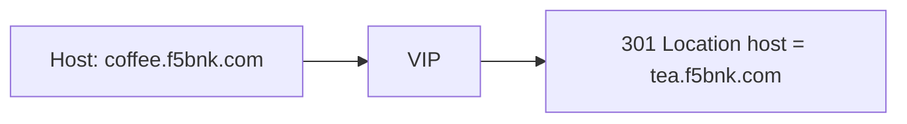

# 2.13 HTTP Redirect — hostname

## 구성



## 적용

```bash
kubectl apply -f gw-http-route.yaml
```

명령은 VIP `40.30.20.20` 에 터널로 도달하는 클라이언트에서 실행합니다.

## 클라이언트 검증

### 1. hostname 변경

```bash
curl -sS -D - -o /tmp/gw-body --max-redirs 0 -H 'Host: coffee.f5bnk.com' http://40.30.20.20/; echo
```

**기대 응답**
- HTTP/1.1 301
- Location 호스트가 `tea.f5bnk.com`

## 정리

```bash
kubectl delete -f gw-http-route.yaml
```
